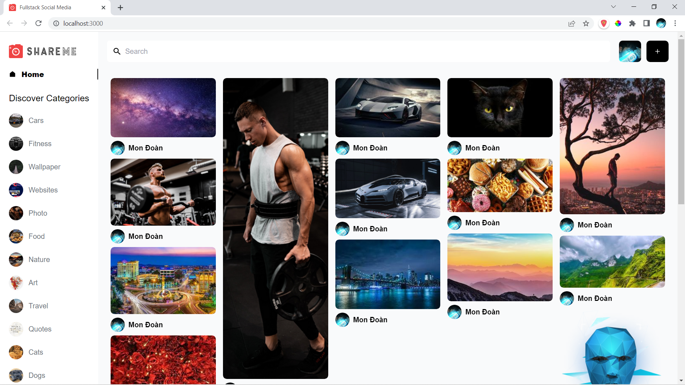

**SHAREME REACTJS WEB APP**

***

This original idea is from ***JavaScript Mastery*** (check-out the channel here: [JavaScript Mastery](https://www.youtube.com/c/JavaScriptMastery))

This web app is built with:
# Front-end: ReactJS and TailwindCSS
# Back-end: Sanity platform ([Sanity.io](https://www.sanity.io/))

My (cloned) web app is deployed at [Fullstack Social Media](https://fullstack-social-media.netlify.app/)